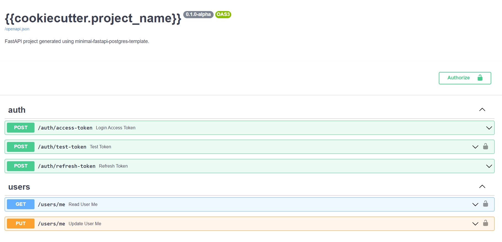

## Small FastAPI template, all boring and tedious things covered



- SQLAlchemy using new 2.0 API + async queries
- Postgresql database under `asyncpg`
- Alembic migrations
- Very minimal project structure yet ready for quick start building new api
- Refresh token endpoint (not only access like in official template)
- Two databases in docker-compose.yml (second one for tests)
- poetry
- `pre-push.sh` script with poetry export, autoflake, black, isort and flake8
- Setup for async tests, one func test for token flow and very extensible `conftest.py`

## What this repo is

This is a minimal template for FastAPI backend + postgresql db as of 2021.11, `async` style for database sessions, endpoints and tests. It provides basic codebase that almost every application has, but nothing more.

## What this repo is not

It is not complex, full featured solutions for all human kind problems. It doesn't include any third party that isn't necessary for most of apps (dashboards, queues) or implementation differs so much in every project that it's pointless (complex User model, emails, RBAC, permissions).

## Quickstart

```bash
# Install cookiecutter globally
pip install cookiecutter

# And cookiecutter this project :)
cookiecutter https://github.com/rafsaf/minimal-fastapi-postgres-template

cd project_name
# Poetry install (and activate environment!)
poetry install
# Setup two databases
docker-compose up -d
# Alembic migrations upgrade and initial_data.py script
bash init.sh
# And this is it:
uvicorn app.main:app --reload
```

tests:

```bash
# Note, it will use second database declared in docker-compose.yml, not default one
pytest

```

## About

This project is heavily base on official template https://github.com/tiangolo/full-stack-fastapi-postgresql (and on my previous work: [link1](https://github.com/rafsaf/fastapi-plan), [link2](https://github.com/rafsaf/docker-fastapi-projects)), but as it is now not too much up-to-date, it is much easier to create new one than change official. I didn't like some of conventions over there also (`crud` and `db` folders for example).

`2.0` style SQLAlchemy API is good enough so there is no need to write everything in `crud` and waste our time... The `core` folder was also rewritten. There is great base for writting tests in `tests`, but I didn't want to write hundreds of them, I noticed that usually after changes in the structure of the project, auto tests are useless and you have to write them from scratch anyway (delete old ones...), hence less than more. Similarly with the `User` model, it is very modest, because it will be adapted to the project anyway (and there are no tests for these endpoints, you would remove them probably).

## Step by step example

I always enjoy to to have some kind of example in templates (even if I don't like it much, _some_ parts may be useful and save my time...), so let's create `POST` endpoint for creating dogs.
