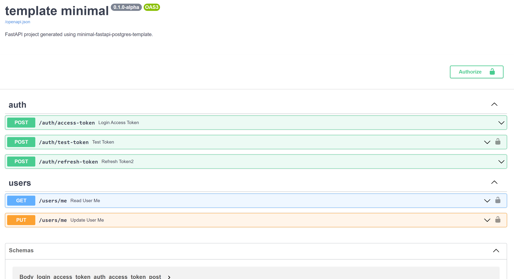

<a href="https://minimal-fastapi-postgres-template.rafsaf.pl/" target="_blank">
    
</a>
<a href="https://github.com/rafsaf/minimal-fastapi-postgres-template/blob/main/LICENSE" target="_blank">
    
</a>
<a href="https://docs.python.org/3/whatsnew/3.10.html" target="_blank">
    
</a>
<a href="https://github.com/psf/black" target="_blank">
    
</a>
<a href="https://github.com/rafsaf/minimal-fastapi-postgres-template/actions/workflows/tests.yml" target="_blank">
    
</a>

# Minimal async FastAPI + PostgreSQL template

- [Minimal async FastAPI + PostgreSQL template](#minimal-async-fastapi--postgresql-template)
  - [Features](#features)
  - [Quickstart](#quickstart)
    - [1. Install cookiecutter globally and cookiecutter this project](#1-install-cookiecutter-globally-and-cookiecutter-this-project)
    - [2. Install dependecies with poetry or without it](#2-install-dependecies-with-poetry-or-without-it)
    - [3. Setup databases](#3-setup-databases)
    - [4. Now you can run app](#4-now-you-can-run-app)
    - [Running tests](#running-tests)
  - [About](#about)
  - [Step by step example - POST and GET endpoints](#step-by-step-example---post-and-get-endpoints)
    - [1. Create SQLAlchemy model](#1-create-sqlalchemy-model)
    - [2. Create and apply alembic migration](#2-create-and-apply-alembic-migration)
    - [3. Create request and response schemas](#3-create-request-and-response-schemas)
    - [4. Create endpoints](#4-create-endpoints)
    - [5. Write tests](#5-write-tests)
  - [Deployment strategies - via Docker image](#deployment-strategies---via-docker-image)
  - [Docs URL, CORS and Allowed Hosts](#docs-url-cors-and-allowed-hosts)

## Features

- [x] SQLAlchemy 1.4 using new 2.0 API, async queries, and dataclasses in SQLAlchemy models for best possible autocompletion support
- [x] Postgresql database under `asyncpg`
- [x] [Alembic](https://alembic.sqlalchemy.org/en/latest/) migrations
- [x] Very minimal project structure yet ready for quick start building new apps
- [x] Refresh token endpoint (not only access like in official template)
- [x] Two databases in docker-compose.yml (second one for tests) and ready to go Dockerfile with [Nginx Unit](https://unit.nginx.org/) webserver
- [x] [Poetry](https://python-poetry.org/docs/) and Python 3.10 based
- [x] `pre-push.sh` script with poetry export, autoflake, black, isort and flake8
- [x] Rich setup for pytest async tests with few included and extensible `conftest.py`

<br>

_Check out also online example: https://minimal-fastapi-postgres-template.rafsaf.pl, it's 100% code used in template with added domain and https only._



## Quickstart


### 1. Install cookiecutter globally and cookiecutter this project
```bash
pip install cookiecutter

# And cookiecutter this project :)
cookiecutter https://github.com/rafsaf/minimal-fastapi-postgres-template

# if you want experimental fastapi-users template
# check "experimental_fastapi_users_template"
# to True in cookiecutter option
```

### 2. Install dependecies with poetry or without it
```bash
cd project_name
### Poetry install (python3.10)
poetry install

### Optionally there are also requirements
python3.10 -m venv venv
source venv/bin/activate
pip install -r requirements-dev.txt
```
Note, be sure to use `python3.10` with this template with either poetry or standard venv & pip, if you need to stick to some earlier python version, you should adapt it yourself (remove python3.10+ specific syntax for example `str | int`)

### 3. Setup databases
```bash
### Setup two databases
docker-compose up -d

### Alembic migrations upgrade and initial_data.py script
bash init.sh
```
### 4. Now you can run app
```bash
### And this is it:
uvicorn app.main:app --reload

```
You should then use `git init` to initialize git repository and access OpenAPI spec at http://localhost:8000/ by default. To customize docs url, cors and allowed hosts settings, read section about it.


### Running tests

```bash
# Note, it will use second database declared in docker-compose.yml, not default one
pytest

# collected 7 items

# app/tests/test_auth.py::test_auth_access_token PASSED                                                                       [ 14%]
# app/tests/test_auth.py::test_auth_access_token_fail_no_user PASSED                                                          [ 28%]
# app/tests/test_auth.py::test_auth_refresh_token PASSED                                                                      [ 42%]
# app/tests/test_users.py::test_read_current_user PASSED                                                                      [ 57%]
# app/tests/test_users.py::test_delete_current_user PASSED                                                                    [ 71%]
# app/tests/test_users.py::test_reset_current_user_password PASSED                                                            [ 85%]
# app/tests/test_users.py::test_register_new_user PASSED                                                                      [100%]
#
# ======================================================== 7 passed in 1.75s ========================================================
```

<br>

## About

This project is heavily based on the official template https://github.com/tiangolo/full-stack-fastapi-postgresql (and on my previous work: [link1](https://github.com/rafsaf/fastapi-plan), [link2](https://github.com/rafsaf/docker-fastapi-projects)), but as it now not too much up-to-date, it is much easier to create new one than change official. I didn't like some of conventions over there also (`crud` and `db` folders for example or `schemas` with bunch of files).

`2.0` style SQLAlchemy API is good enough so there is no need to write everything in `crud` and waste our time... The `core` folder was also rewritten. There is great base for writting tests in `tests`, but I didn't want to write hundreds of them, I noticed that usually after changes in the structure of the project, auto tests are useless and you have to write them from scratch anyway (delete old ones...), hence less than more. Similarly with the `User` model, it is very modest, with just `id` (uuid), `email` and `password_hash`, because it will be adapted to the project anyway.

<br>

## Step by step example - POST and GET endpoints

I always enjoy to have some kind of an example in templates (even if I don't like it much, _some_ parts may be useful and save my time...), so let's create two example endpoints:

- `POST` endpoint `/pets/create` for creating `Pets` with relation to currently logged `User`
- `GET` endpoint `/pets/me` for fetching all user's pets.

<br>

### 1. Create SQLAlchemy model

We will add Pet model to `app/models.py`. To keep things clear, below is full result of models.py file.

```python
# app/models.py

import uuid
from dataclasses import dataclass, field

from sqlalchemy import Column, ForeignKey, Integer, String
from sqlalchemy.dialects.postgresql import UUID
from sqlalchemy.orm import registry, relationship

Base = registry()


@Base.mapped
@dataclass
class User:
    __tablename__ = "user_model"
    __sa_dataclass_metadata_key__ = "sa"

    id: uuid.UUID = field(
        init=False,
        default_factory=uuid.uuid4,
        metadata={"sa": Column(UUID(as_uuid=True), primary_key=True)},
    )
    email: str = field(
        metadata={"sa": Column(String(254), nullable=False, unique=True, index=True)}
    )
    hashed_password: str = field(metadata={"sa": Column(String(128), nullable=False)})


@Base.mapped
@dataclass
class Pet:
    __tablename__ = "pets"
    __sa_dataclass_metadata_key__ = "sa"

    id: int = field(init=False, metadata={"sa": Column(Integer, primary_key=True)})
    user_id: uuid.UUID = field(
        metadata={"sa": Column(ForeignKey("user_model.id", ondelete="CASCADE"))},
    )
    pet_name: str = field(
        metadata={"sa": Column(String(50), nullable=False)},
    )


```

Note, we are using super powerful SQLAlchemy feature here - you can read more about this fairy new syntax based on dataclasses [in this topic in the docs](https://docs.sqlalchemy.org/en/14/orm/declarative_styles.html#example-two-dataclasses-with-declarative-table).

<br>

### 2. Create and apply alembic migration

```bash
### Use below commands in root folder in virtualenv ###

# if you see FAILED: Target database is not up to date.
# first use alembic upgrade head

# Create migration with alembic revision
alembic revision --autogenerate -m "create_pet_model"


# File similar to "2022050949_create_pet_model_44b7b689ea5f.py" should appear in `/alembic/versions` folder


# Apply migration using alembic upgrade
alembic upgrade head

# (...)
# INFO  [alembic.runtime.migration] Running upgrade d1252175c146 -> 44b7b689ea5f, create_pet_model
```

PS. Note, alembic is configured in a way that it work with async setup and also detects specific column changes.

<br>

### 3. Create request and response schemas

Note, I personally lately (after seeing clear benefits at work) prefer less files than a lot of them for things like schemas.

Thats why there are only 2 files: `requests.py` and `responses.py` in `schemas` folder and I would keep it that way even for few dozen of endpoints.

```python
# app/schemas/requests.py

(...)


class PetCreateRequest(BaseRequest):
    pet_name: str

```

```python
# app/schemas/responses.py

(...)


class PetResponse(BaseResponse):
    id: int
    pet_name: str
    user_id: uuid.UUID

```

<br>

### 4. Create endpoints

```python
# /app/api/endpoints/pets.py

from fastapi import APIRouter, Depends
from sqlalchemy import select
from sqlalchemy.ext.asyncio import AsyncSession

from app.api import deps
from app.models import Pet, User
from app.schemas.requests import PetCreateRequest
from app.schemas.responses import PetResponse

router = APIRouter()


@router.post("/create", response_model=PetResponse, status_code=201)
async def create_new_pet(
    new_pet: PetCreateRequest,
    session: AsyncSession = Depends(deps.get_session),
    current_user: User = Depends(deps.get_current_user),
):
    """Creates new pet. Only for logged users."""

    pet = Pet(user_id=current_user.id, pet_name=new_pet.pet_name)

    session.add(pet)
    await session.commit()
    return pet


@router.get("/me", response_model=list[PetResponse], status_code=200)
async def get_all_my_pets(
    session: AsyncSession = Depends(deps.get_session),
    current_user: User = Depends(deps.get_current_user),
):
    """Get list of pets for currently logged user."""

    pets = await session.execute(
        select(Pet)
        .where(
            Pet.user_id == current_user.id,
        )
        .order_by(Pet.pet_name)
    )
    return pets.scalars().all()

```

Also, we need to add newly created endpoints to router.

```python
# /app/api/api.py

from fastapi import APIRouter

from app.api.endpoints import auth, pets, users

api_router = APIRouter()
api_router.include_router(auth.router, prefix="/auth", tags=["auth"])
api_router.include_router(users.router, prefix="/users", tags=["users"])
api_router.include_router(pets.router, prefix="/pets", tags=["pets"])

```

<br>

### 5. Write tests

```python
# /app/tests/test_pets.py

from httpx import AsyncClient
from sqlalchemy.ext.asyncio import AsyncSession

from app.main import app
from app.models import Pet, User


async def test_create_new_pet(
    client: AsyncClient, default_user_headers, default_user: User
):
    response = await client.post(
        app.url_path_for("create_new_pet"),
        headers=default_user_headers,
        json={"pet_name": "Tadeusz"},
    )
    assert response.status_code == 201
    result = response.json()
    assert result["user_id"] == str(default_user.id)
    assert result["pet_name"] == "Tadeusz"


async def test_get_all_my_pets(
    client: AsyncClient, default_user_headers, default_user: User, session: AsyncSession
):

    pet1 = Pet(default_user.id, "Pet_1")
    pet2 = Pet(default_user.id, "Pet_2")
    session.add(pet1)
    session.add(pet2)
    await session.commit()

    response = await client.get(
        app.url_path_for("get_all_my_pets"),
        headers=default_user_headers,
    )
    assert response.status_code == 200

    assert response.json() == [
        {
            "user_id": str(pet1.user_id),
            "pet_name": pet1.pet_name,
            "id": pet1.id,
        },
        {
            "user_id": str(pet2.user_id),
            "pet_name": pet2.pet_name,
            "id": pet2.id,
        },
    ]

```

## Deployment strategies - via Docker image

This template has by default included `Dockerfile` with [Nginx Unit](https://unit.nginx.org/) webserver, that is my prefered choice, because of direct support for FastAPI and great ease of configuration. You should be able to run container(s) (over :80 port) and then need to setup the proxy, loadbalancer, with https enbaled, so the app stays behind it.

`nginx-unit-config.json` file included in main folder has some default configuration options, runs app in single process and thread. More info about config file here https://unit.nginx.org/configuration/#python and about also read howto for FastAPI: https://unit.nginx.org/howto/fastapi/.

If you prefer other webservers for FastAPI, check out [Daphne](https://github.com/django/daphne), [Hypercorn](https://pgjones.gitlab.io/hypercorn/index.html) or [Uvicorn](https://www.uvicorn.org/).

## Docs URL, CORS and Allowed Hosts

There are some **opinionated** default settings in `/app/main.py` for documentation, CORS and allowed hosts.

1. Docs

    ```python
    app = FastAPI(
        title=config.settings.PROJECT_NAME,
        version=config.settings.VERSION,
        description=config.settings.DESCRIPTION,
        openapi_url="/openapi.json",
        docs_url="/",
    )
    ```
    Docs page is simpy `/` (by default in FastAPI it is `/docs`). Title, version and description are taken directly from `config` and then directly from `pyproject.toml` file. You can change it completely for the project, remove or use environment variables `PROJECT_NAME`, `VERSION`, `DESCRIPTION`.

2. CORS 

    ```python
    app.add_middleware(
        CORSMiddleware,
        allow_origins=[str(origin) for origin in config.settings.BACKEND_CORS_ORIGINS],
        allow_credentials=True,
        allow_methods=["*"],
        allow_headers=["*"],
    )
    ```

    If you are not sure what are CORS for, follow https://developer.mozilla.org/en-US/docs/Web/HTTP/CORS. React and most frontend frameworks nowadays operate on `localhost:3000` thats why it's included in `BACKEND_CORS_ORIGINS` in .env file, before going production be sure to include and frontend domain here, like `my-fontend-app.example.com`

3. Allowed Hosts

    ```python
    app.add_middleware(TrustedHostMiddleware, allowed_hosts=config.settings.ALLOWED_HOSTS)
    ```

    Prevents HTTP Host Headers attack, you shoud put here you server IP or (preferably) full domain under it's accessible like `example.com`. By default in .env there are two most popular records: `ALLOWED_HOSTS=["localhost", "127.0.0.1"]`

