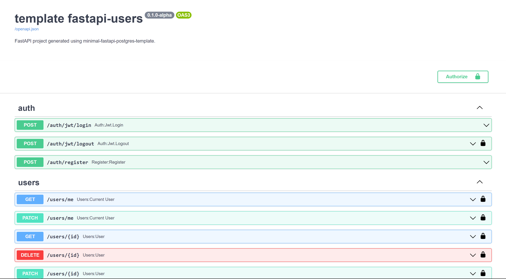

<a href="https://github.com/rafsaf/minimal-fastapi-postgres-template/actions?query=workflow%3Atests" target="_blank">
    
</a>

<a href="https://github.com/rafsaf/minimal-fastapi-postgres-template/blob/main/LICENSE" target="_blank">
    
</a>

:information_source: This repository contains two different templates to choose from.

## Minimal async FastAPI + postgresql template


- SQLAlchemy using new 2.0 API + async queries
- Postgresql database under `asyncpg`
- Alembic migrations
- Very minimal project structure yet ready for quick start building new api
- Refresh token endpoint (not only access like in official template)
- Two databases in docker-compose.yml (second one for tests)
- poetry
- `pre-push.sh` script with poetry export, autoflake, black, isort and flake8
- Setup for async tests, one func test for token flow and very extensible `conftest.py`

## Async FastAPI + postgresql template based on [fastapi-users](https://fastapi-users.github.io/fastapi-users/)

- SQLAlchemy using new 2.0 API + async queries
- Postgresql database under `asyncpg`
- Alembic migrations
- Very minimal project structure yet ready for quick start building new api
- Refresh token endpoint (not only access like in official template)
- Two databases in docker-compose.yml (second one for tests)
- poetry
- `pre-push.sh` script with poetry export, autoflake, black, isort and flake8
- Setup for async tests, one func test for token flow and very extensible `conftest.py`



## What this repo is

This is a minimal template for FastAPI backend + postgresql db as of 2021.11, `async` style for database sessions, endpoints and tests. It provides basic codebase that almost every application has, but nothing more.

## What this repo is not

It is not complex, full featured solutions for all human kind problems. It doesn't include any third party that isn't necessary for most of apps (dashboards, queues) or implementation differs so much in every project that it's pointless (complex User model, emails, RBAC, permissions).

## Quickstart

```bash
# Install cookiecutter globally
pip install cookiecutter

# And cookiecutter this project :)
cookiecutter https://github.com/rafsaf/minimal-fastapi-postgres-template

cd project_name
# Poetry install (and activate environment!)
poetry install
# Setup two databases
docker-compose up -d
# Alembic migrations upgrade and initial_data.py script
bash init.sh
# And this is it:
uvicorn app.main:app --reload
```

tests:

```bash
# Note, it will use second database declared in docker-compose.yml, not default one
pytest

```

## About

This project is heavily base on official template https://github.com/tiangolo/full-stack-fastapi-postgresql (and on my previous work: [link1](https://github.com/rafsaf/fastapi-plan), [link2](https://github.com/rafsaf/docker-fastapi-projects)), but as it is now not too much up-to-date, it is much easier to create new one than change official. I didn't like some of conventions over there also (`crud` and `db` folders for example).

`2.0` style SQLAlchemy API is good enough so there is no need to write everything in `crud` and waste our time... The `core` folder was also rewritten. There is great base for writting tests in `tests`, but I didn't want to write hundreds of them, I noticed that usually after changes in the structure of the project, auto tests are useless and you have to write them from scratch anyway (delete old ones...), hence less than more. Similarly with the `User` model, it is very modest, because it will be adapted to the project anyway (and there are no tests for these endpoints, you would remove them probably).

## Step by step example

I always enjoy to to have some kind of example in templates (even if I don't like it much, _some_ parts may be useful and save my time...), so let's create `POST` endpoint for creating dogs.

### 1. Add `HappyDog` model

```python
# /app/models.py
(...)

class HappyDog(Base):
    __tablename__ = "happy_dog"
    id = Column(Integer, primary_key=True, index=True)
    puppy_name = Column(String(500))
    puppy_age = Column(Integer)
```

### 2. Create and apply alembic migrations

```bash
# Run
alembic revision --autogenerate -m "add_happy_dog"

# Somethig like `YYYY-MM-DD-....py` will appear in `/alembic/versions` folder

alembic upgrade head

# (...)
# INFO  [alembic.runtime.migration] Running upgrade cefce371682e -> 038f530b0e9b, add_happy_dog
```

PS. Note, alembic is configured in a way that it work with async setup and also detects specific column changes.

### 3. Create schemas

```python
# /app/schemas/happy_dog.py

from typing import Optional

from pydantic import BaseModel


class BaseHappyDog(BaseModel):
    puppy_name: str
    puppy_age: Optional[int]


class CreateHappyDog(BaseHappyDog):
    pass


class HappyDog(BaseHappyDog):
    id: int

```

Then add it to schemas `__init__.py`

```python
# /app/schemas/__init__.py

from .token import Token, TokenPayload, TokenRefresh
from .user import User, UserCreate, UserUpdate
from .happy_dog import HappyDog, CreateHappyDog
```

### 4. Create endpoint

```python
# /app/api/endpoints/dogs.py

from typing import Any
from fastapi import APIRouter, Depends
from sqlalchemy.ext.asyncio import AsyncSession

from app import models, schemas
from app.api import deps

router = APIRouter()


@router.post("/", response_model=schemas.HappyDog, status_code=201)
async def create_happy_dog(
    dog_create: schemas.CreateHappyDog,
    session: AsyncSession = Depends(deps.get_session),
    current_user: models.User = Depends(deps.get_current_active_user),
) -> Any:
    """
    Creates new happy dog. Only for logged users.
    """
    new_dog = models.HappyDog(
        puppy_name=dog_create.puppy_name, puppy_age=dog_create.puppy_age
    )

    session.add(new_dog)
    await session.commit()
    await session.refresh(new_dog)

    return new_dog

```

Also, add it to router

```python
# /app/api/api.py

from fastapi import APIRouter

from app.api.endpoints import auth, users, dogs

api_router = APIRouter()
api_router.include_router(auth.router, prefix="/auth", tags=["auth"])
api_router.include_router(users.router, prefix="/users", tags=["users"])
# new content below
api_router.include_router(dogs.router, prefix="/dogs", tags=["dogs"])

```

### 5. Test it simply

```python
# /app/tests/test_dogs.py

import pytest
from httpx import AsyncClient
from app.models import User

pytestmark = pytest.mark.asyncio


async def test_dog_endpoint(client: AsyncClient, default_user: User):
    # better to create fixture auth_client or similar than repeat code with access_token
    access_token = await client.post(
        "/auth/access-token",
        data={
            "username": "user@email.com",
            "password": "password",
        },
        headers={"Content-Type": "application/x-www-form-urlencoded"},
    )
    assert access_token.status_code == 200
    access_token = access_token.json()["access_token"]

    puppy_name = "Sonia"
    puppy_age = 6

    create_dog = await client.post(
        "/dogs/",
        json={"puppy_name": puppy_name, "puppy_age": puppy_age},
        headers={"Authorization": f"Bearer {access_token}"},
    )
    assert create_dog.status_code == 201
    create_dog_json = create_dog.json()
    assert create_dog_json["puppy_name"] == puppy_name
    assert create_dog_json["puppy_age"] == puppy_age

```
